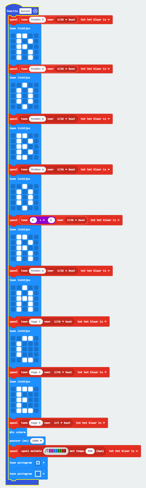
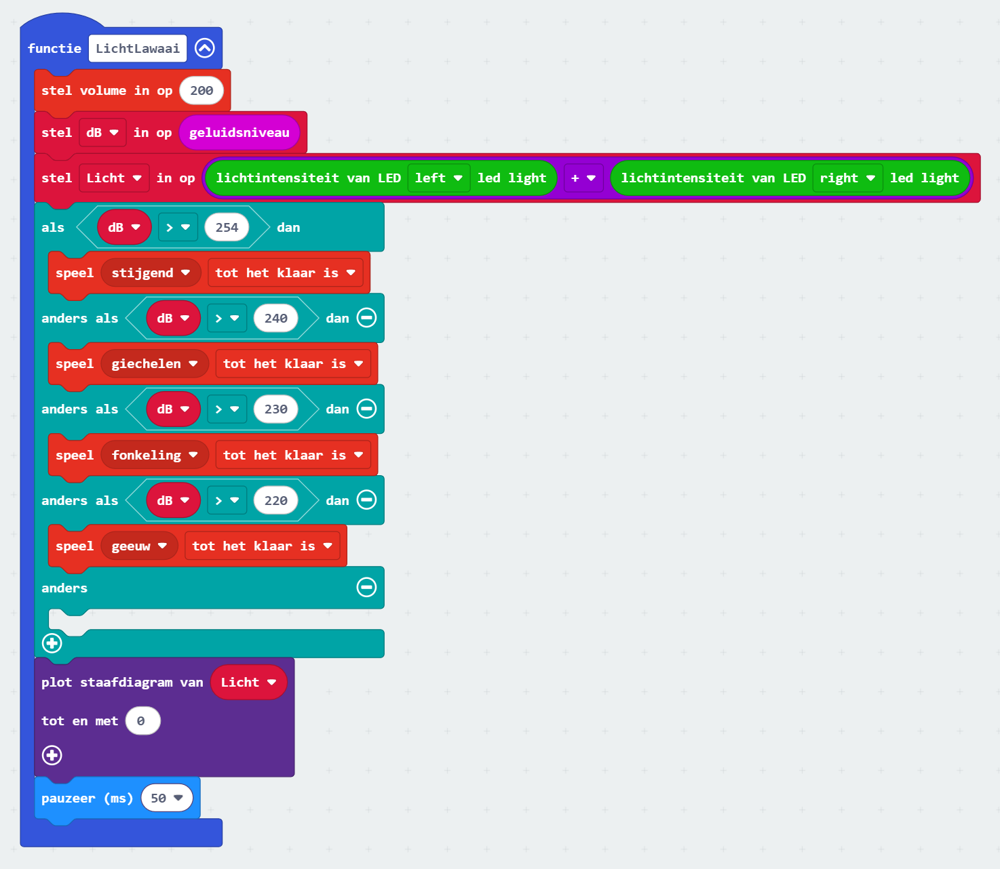

## Programma documentatie ['Ontdek Zintuigen'](#ontdek-zintuigen-applicatie) kennismakingsprogramma

1. Bij Opstarten-lus
   #### Functionaliteit:
   * Overige initialisaties [zie Functie Init]
   #### Aangeroepen functies:
   * **Init**
     
2. De hele tijd-lus
   #### Functionaliteit:
   * Verzorgen afstandsmeting en audio-feedback (dichtbij -> hogere toon)
      ##### Actief als: Mode=="Verken" EN AfstandMode==true
   #### Aangeroepen functies:
   * **AfstandToon**
     
3. De hele tijd-lus
   #### Functionaliteit:
   * Afhandelen Response Licht en Lawaaisensors
      ##### Actief als: Mode=="Verken" EN LichtLawaaiMode==true 
   #### Aangeroepen functies:
   * **LichtLawaai**
     
   
4. Bij ontvangst IR bericht-lus
   #### Functionaliteit:
   * Afhandeling Ontvangst en respons IR Afstandsbedieningssignalen
   #### Aangeroepen functies:
   * **IR_Actie**
    
   
5. De hele tijd-lus
   #### Functionaliteit:
   * Afhandeling lijnvolgen/obstakeldetectie/bewegen via afstandsbediening
        ##### Actief als: Mode=="Rijden EN VolgLijn==true
        * Als obstakel binnen 7cm: Stop lijnvolgen
        * Schakel motoren uit; robot wacht op bewegingsopdracht
    
 
6. Functies
   * [**Init**](#function-init)
      * Initialiseer I2C communicatie Micro:bit <-> Maqueen moederbord
      * Leid seriele communicatie om naar USB (voor debuggen/ontwikkelen)
      * Initialiseer Infraroodsensor
      * Initialiseer Neopixel RGB Leds Onderzijde Maqueen moederboard
      * Initialiseer decodeertabel HX1838 IR afstandsbediening
      * Initialiseer buffers tbv IR interpretatie
      * Initialiseer diverse varialbelen
      * Aanroep **Splash** functie: Toon 'splash' screen op LED-matrix
   * [**Splash**](#function-splash)
      * Toon Letters 'Roborace' op LED-matrix met herkenningsmelodie
      * Toon Symbool en geluid voor "Verken"mode
   * [**AfstandToon**](#function-afstandtoon)
      * Lees afstand, bereken toonhoogte omgekeerd evenredig met afstand
      * Indien afstand <20cm laat geluid horen, daarboven geluid uit
   * [**LichtLawaai**](#function-lichtlawaai)
      *  zet volume hoog
      *  bepaal geluidsniveau, ken toe aan variabele dB
      *  laat geluidsniveauafhankelijk riedeltje horen
   * [**ClearBufStat**](#function-clearbufstat)
      * Leeg de IR ontvangstbuffers na modechange
   * [**IR_actie**](#function-ir_actie)
      * Lees IR code, ken toe aan variabele IRcode
      * Aanroep [**LeesKnop**](#function-leesknop)
      * Voeg geinterpreteerde code toe aan buffer
      * Verwijder oudste waarde in buffer (buffer lengte 4, om Modeswitch te kunnen detecteren)
      * Aanroep [**CheckControlCode**](#function-checkcontrolcode)
   * [**LeesKnop**](#function-leesknop)
      * Evalueer ruwe IR code, wijs functioneel label en statuslabel toe (num,ster,hekje,control) en voeg toe aan IR-buffer en Status-buffer
   *  [**CheckControlCode**](#function-checkcontrolcode)
      * Evalueer buffer voor Modeswitch, Hekje-code, numerical and control en zet bijbehorende booleans.
      * Zet bij detectie Switchmode (*11# = 'Verken'; *22# = 'Rijden') de mode, laat modegeluid horen en toon bijbehorend pictogram op LEDmatrix 
   *  [**ToonKnop**](#function-toonknoop)
      * Laat in verkenmode knoplabel zien als numeriek
      * Evalueer in verkenmode de hekjes-code en verzorg bijbehorende interactie
         * #1 Linker Koplamp aan/uit (rood)
         * #2 Rechter Koplamp aan/uit (rood)
         * #3 Cycle by iedere stimulus verder door de kleurenreeks voor linker koplamp, Roep **SetLkleur** aan
         * #4 Cycle by iedere stimulus verder door de kleurenreeks voor rechter koplamp, Roep **SetRkleur** aan
         * #5 Zet auto kleurcyclusmode aan/uit (disco mode)
         * #6 Roep **Soundface** aan
         * #7 Draai rondje linksom (Rechtermotor vooruit, Linkermotor achteruit, 1 seconde, daarna motoren uit)
         * #8 Draai rondje rechtsom (Rechtermotor achteruit, Linkermotor vooruit, 1 seconde, daarna motoren uit)
         * #9 Set/reset Afstandmode, Als Afstandsmode aanroep **Wave**
         * #0 Set/reset LichtLawaaimode, Toon LL pictogram
      * In 'Rijden'mode evalueer control code
         *  start/stop vooruit/achteruit/linksom/rechtsom
         *  Volg lijnmode aan/uit, Als volglijn, toon VL pictogram 
   *  [**SetLKleur**](#function-setlkleur)
      * Hoog kleurenteller Links op, teller = teller(mod)7, Zet corresponderende koplampkleur Links
   *  [**SetRKleur**](#function-setrkleur)
      * Hoog kleuren teller Rechts op, teller = teller(mod)7, Zet corresponderende koplampkleur Rechts
   *  [**Soundface**](#function-soundface)
      * Hoog Soundface teller op, teller = teller(mod)4, Toon corresponderend pictogram en bijbehorend geluidje
   *  [**Wave**](#function-wave)
      * Toon opeenvolgende pictogrammen voor 'wave' animatie, eindig op US (ultrasound) pictogram.  
   
7. Variabelen
   |Variabele          |Type         |Beschrijving|
   |-------------------|-------------|------------|
   | achteruit         |boolean      |rijrichting| 
   | afstand           |int          |Ultrasoon afstand    |
   | Afstandmode       |boolean      |Afstandmode actief|
   | Buf0              |string       |IR buffer waarde index 0|
   | Buf1              |string       |IR buffer waarde index 1|
   | Buf2              |string       |IR buffer waarde index 2|
   | Buf3              |string       |IR buffer waarde index 3|
   | Bufstat           |StringArray  |status of buffer index(x)|
   | ccw               |boolean      |rotatierichting|
   | dB                |int          |geluidsniveau|
   | IRbuffer          |StringArray  |Decoded IR codes|
   | IRcode            |int          |IR code|
   | iscontrolcode     |boolean      |Control code gedetecteerd in IR code|
   | ishash            |boolean      |Hekje gedetecteerd in IR code|
   | ishashcode        |boolean      |Hekje-code|
   | isnum             |boolean      |IR code is numeriek|
   | IsSwitchMode      |boolean      |Switch mode detected|
   | Koplampdisco      |boolean      |Koplampendisco aan/uit|
   | KoplampL          |boolean      |Linkerkoplamp aan/uit|
   | KoplampR          |boolean      |Rechter koplamp aan/uit|
   | LichtLawaaiMode   |boolean      |Licht/Lawaaimode aan/uit|
   | LinksAf           |boolean      |Rijrichting links aan/uit|
   | Lkleur            |int          |Kleurindex Linker koplamp|
   | mode              |string       |active mode|
   | RechtsAf          |boolean      |Rijrichting rechts aan/uit|
   | Rkleur            |int          |Kleurindex Rechter koplamp|
   | toon              |int          |Toonhoogte|
   | volglijn          |boolean      |Lijnvolgmode actief/inactief|
   | vooruit           |boolean      |Rijrichting vooruit aan/uit|
    
9. Geladen extensies
    * [Maqueen-pxt](https://github.com/ousiris/pxt-maqueen) fork van DFRobot extension, met .nl localisatie
    * [newIR](https://github.com/DFRobot/pxt-DFRobot_newIR) Basis IR Afstandsbediening support, packaged met Maqueen extensie
    * [Neopixel](https://makecode.microbit.org/pkg/microsoft/pxt-neopixel) Support voor WS2812B RGB LEDS onderzijde Maqueen
    * [RemoteControlMapping](https://github.com/RoboraceMSW/RemoteControlMapping) Functionele Toetscode Mapping voor o.a. HX1838 IR Afstandsbediening

## Afbeeldingen

### Ontdek Zintuigen Applicatie
  

### Main program 
  

### Function Init
  

## Function Splash
  
 
## Function AfstandToon
  

## Function LichtLawaai
  

## Function IR_Actie
  

## Function LeesKnop
  

## Function CheckControlCode
  

## Function ToonKnop
  

## Function ClearBufStat
  

## Function ZetLkleur
  

## Function ZetRkleur
  

## Function Wave
  

## Function SoundFace
  
